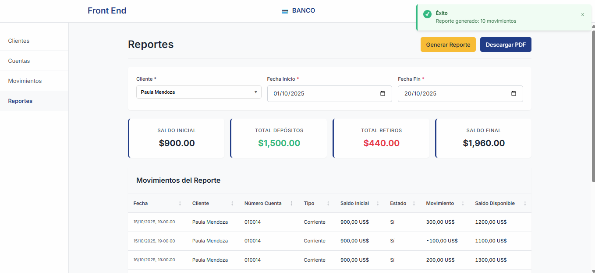

<div align="center">
  
  <h1>Arquetipo MFA · Nexus Portal Web (Banking Portal)</h1>

  <p>Frontend bancario moderno basado en Angular 20, arquitectura modular y Micro Frontends.</p>

  <p>
    
  </p>

  <p>
     
     
     
    
  </p>
</div>

---

### Backend (Apex Core Service)

- Documento completo del proyecto – SPF MSA APEX CORE SERVICE
- Fecha: 19 de Octubre, 2025 · Versión: 1.0
- Proyecto: Microservicio Bancario – Gestión de Clientes, Cuentas y Transacciones
- Enlace: [Repositorio y Endpoints API](https://github.com/Jeffers199817/spf-msa-apex-core-service/tree/main?tab=readme-ov-file#-endpoints-api)

Inicio rápido (Docker):

```bash
# Backend - construir y ejecutar
docker build -t apex-core-service.jar .
docker run -p 9090:9090 apex-core-service.jar
# API disponible en: http://localhost:9090
```

Recursos incluidos del backend:

- BaseDatos.sql – esquema y datos de prueba
- postman_collection.json – endpoints y casos de prueba
- Dockerfile – contenedor listo para producción

### Tabla de contenidos

- Introducción
- Características
- Arquitectura y rutas
- Requisitos
- Instalación y ejecución local
- Comandos disponibles
- Configuración de entornos
- Proxy de desarrollo (API)
- Construcción para producción
- Despliegue con Nginx
- Estructura del proyecto
- Contribución y licencia

---

### Introducción

Este repositorio contiene el frontend del Portal Bancario, nombre del paquete `arquetipo-mfa-nexus-portal-web` y aplicación Angular `banking-portal`. El proyecto aprovecha Module Federation para escenarios de Micro Frontends y sigue buenas prácticas de diseño y mantenimiento.

### Características

- **Angular 20** con Standalone Components
- **Micro Frontends** con Module Federation (`@module-federation/enhanced` + `ngx-build-plus`)
- **Arquitectura modular**: `core`, `features`, `shared`
- **SCSS** y tipografías modernas (Inter)
- **RxJS** para flujos reactivos
- **Testing** con Karma + Jasmine (CLI)

### Arquitectura y rutas

- Rutas principales: `/clients`, `/accounts`, `/movements`, `/reports` (redirección por defecto a `/clients`).
- SPA con `index.html` único y navegación por `Router`.

### Requisitos

- Node.js ≥ 18.19.x (recomendado 20 LTS)
- npm ≥ 9

### Instalación y ejecución local

```bash
git clone <url-del-repositorio>
cd arquetipo-mfa-nexus-portal-web
npm install
npm start
# Disponible en http://localhost:4200
```

Nota: En modo desarrollo se aplica el `proxy.conf.json` automáticamente según `angular.json`.

### Comandos disponibles

```bash
# Desarrollo
npm start                 # ng serve (config dev + proxy)

# Build
npm run build             # build por defecto (production)
npm run build:prod        # build forzado a producción
npm run watch             # build en watch para desarrollo

# Tests
npm test                  # Karma + Jasmine (CLI)
npm run test:ci           # ChromeHeadless sin watch

# SSR (si aplica distribución SSR)
npm run serve:ssr
```

### Configuración de entornos

Los entornos viven en `src/environments`.

```ts
// src/environments/environment.ts (desarrollo)
export const environment = {
  production: false,
  apiUrl: 'http://localhost:9090/spf-msa-apex-core-service',
  appName: 'Banking Portal',
  version: '1.0.0',
  enableLogging: true,
  enableMockData: false,
  features: {
    enableReports: true,
    enablePdfDownload: true,
    enableAdvancedSearch: true
  }
};
```

```ts
// src/environments/environment.prod.ts (producción)
export const environment = {
  production: true,
  apiUrl: 'https://dev-api.pichincha.com/spf-msa-apex-core-service',
  appName: 'Banking Portal',
  version: '1.0.0',
  enableLogging: false,
  enableMockData: false,
  features: {
    enableReports: true,
    enablePdfDownload: true,
    enableAdvancedSearch: true
  }
};
```

### Proxy de desarrollo (API)

El proxy enruta peticiones locales al backend para evitar CORS durante desarrollo.

```json
// proxy.conf.json
{
  "/spf-msa-apex-core-service": {
    "target": "http://localhost:9090",
    "secure": false,
    "changeOrigin": true,
    "logLevel": "info"
  }
}
```

`ng serve` ya usa este proxy según `angular.json` (configuración "development").

### Construcción para producción

Salida por defecto: `dist/banking-portal`.

```bash
npm run build            # producción (output hashing, budgets)
npm run build:prod       # equivalente con flag explícito
```

El proyecto usa `ngx-build-plus` con `webpack.config.js` para habilitar Module Federation.

### Despliegue con Nginx

Se incluye una configuración lista para SPA en `nginx.conf`:

```nginx
# Redirige rutas SPA a index.html y aplica cache estática
location / {
  try_files $uri $uri/ /index.html;
}

location ~* \.(js|css|png|jpg|jpeg|gif|ico|svg|woff|woff2|ttf|eot)$ {
  expires 1y;
  add_header Cache-Control "public, immutable";
}
```

Opcionalmente, puedes exponer `/api/` hacia tu backend ajustando el `proxy_pass`.

### Estructura del proyecto

```
src/
├── app/
│   ├── core/
│   │   ├── models/
│   │   └── services/
│   ├── features/
│   │   ├── clients/
│   │   ├── accounts/
│   │   ├── movements/
│   │   └── reports/
│   ├── shared/
│   │   └── components/
│   └── app.routes.ts
├── environments/
└── styles.scss
```

### Contribución

1. Crea una rama: `git checkout -b feature/nueva-funcionalidad`
2. Haz commits atómicos y claros
3. Abre un Pull Request con contexto y evidencia (capturas o gifs)

### Licencia

MIT. Consulta el archivo `LICENSE` si aplica.

